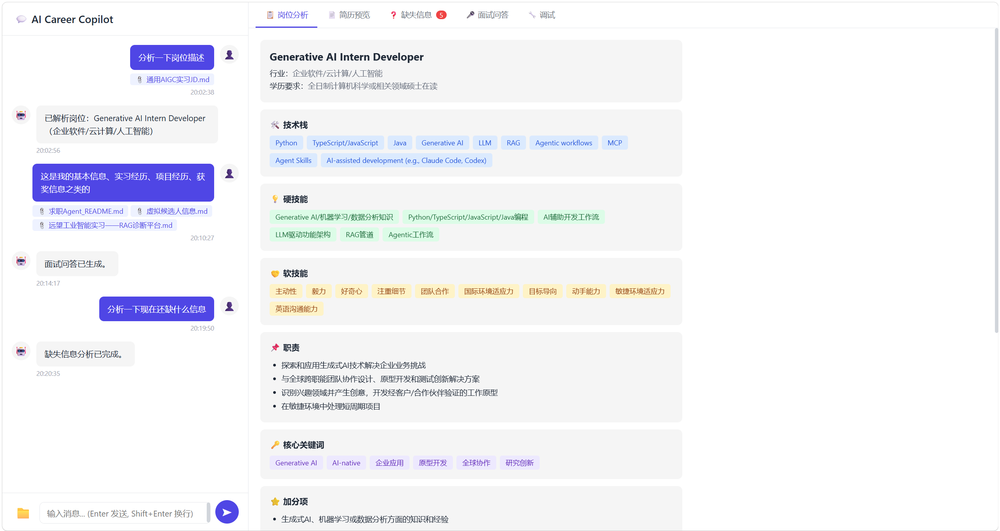
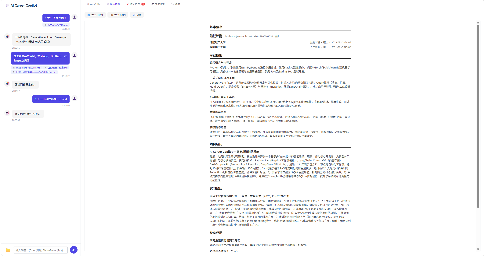
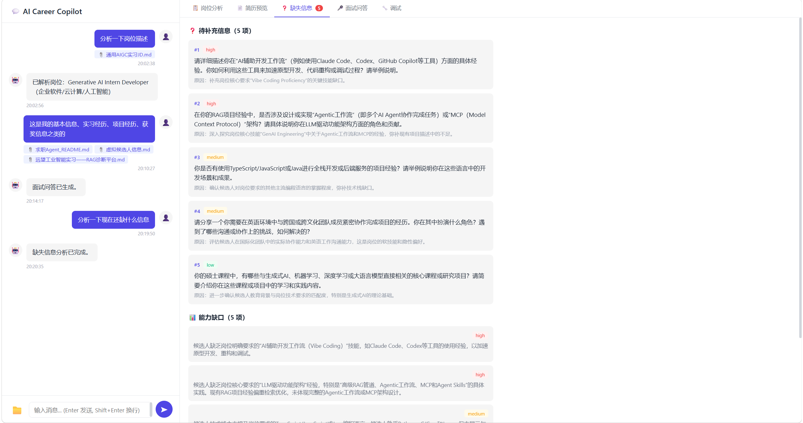
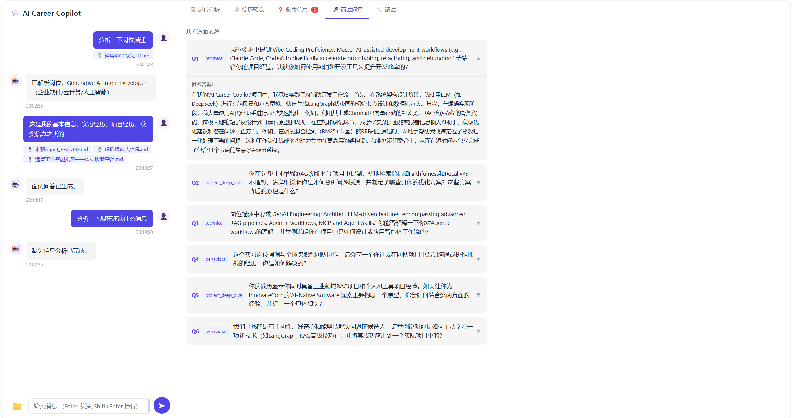
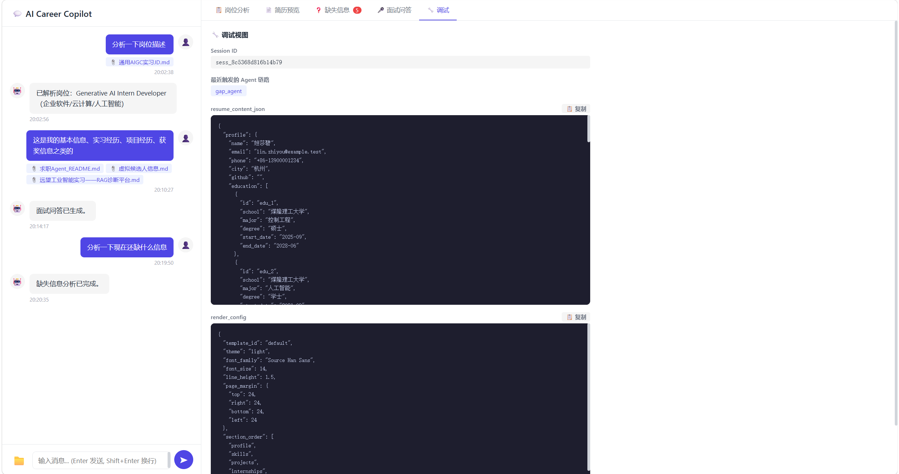

[English](./README.md) | [简体中文](./README.zh-CN.md)

# AI Career Copilot


An AI-powered multi-agent web app for job description analysis, candidate profile extraction, resume generation, HTML resume rendering, gap analysis, and interview Q&A preparation.

The project is already deployed and publicly accessible at [http://8.153.79.69:3001](http://8.153.79.69:3001). If you want to try the full workflow before setting up locally, open the live site and start with a JD upload to see the multi-agent pipeline in action.

## Features

- Multi-turn workflow for JD input, profile input, resume generation, and follow-up editing.
- Agent-based orchestration with LangGraph for planner, JD analysis, profile extraction, gap analysis, content generation, rendering, and interview preparation.
- Structured resume content generation with HTML preview and export endpoints.
- Resume rendering controls exposed through chat-driven render instructions.
- Gap analysis to surface capability mismatches between a target role and candidate materials.
- Interview Q&A generation based on the current role and resume context.
- Web UI built with Vue 3 for chat interaction and result tabs.
- Redis-backed session state plus MySQL persistence for key workflow artifacts.

## Demo

Hosted demo: [http://8.153.79.69:3001](http://8.153.79.69:3001)

You can experience the product as an end user: upload a target JD first, then continue the same conversation with your profile, internship notes, project materials, or follow-up revision requests. The system keeps the current session context and updates the generated results incrementally.

### JD Analysis

The workflow starts from the target role. After a JD is pasted or uploaded, the system extracts responsibilities, keywords, and role expectations that will drive downstream resume generation and interview preparation.



### Resume Generation

Once candidate materials are provided, the content and rendering agents collaborate to generate a structured resume preview that can be refined through natural-language follow-up instructions.



### Gap Analysis

The gap analysis panel highlights what is missing, weak, or unsupported compared with the JD, helping users identify where they should add evidence or clarify experience.



### Mock Interview

The interview panel turns the current role and generated resume context into likely interview questions, making it easier to prepare around the exact target position.



### Debug View

For development and inspection, the debug panel exposes intermediate artifacts such as structured content, render config, and triggered agents in the current session.



## Try It Online

The hosted instance at [http://8.153.79.69:3001](http://8.153.79.69:3001) is the fastest way to evaluate the product experience. It is especially useful if you want to validate the multi-turn workflow, inspect the result tabs, or see how resume edits and missing-information prompts behave before cloning the repository.

If you want the source code or plan to contribute, visit the GitHub repository: [https://github.com/Programmergyt/ai-career-copilot](https://github.com/Programmergyt/ai-career-copilot).

## Project Structure

```text
ai-career-copilot/
├── backend/           # FastAPI app, agents, workflow, storage, prompts, tests
├── frontend/          # Vue 3 + Vite web client
├── docker/            # Dockerfiles and Nginx config for frontend/backend
├── docs/              # Design and planning documents
├── docker-compose.yml
└── README*.md
```

## Tech Stack

| Layer | Stack |
| --- | --- |
| Backend API | FastAPI, Uvicorn |
| Agent orchestration | LangGraph |
| LLM integration | LangChain, DeepSeek |
| Embedding / rerank | DashScope |
| Frontend | Vue 3, Vite, Axios |
| Session store | Redis |
| Persistence | MySQL |
| Configuration | PyYAML, python-dotenv |
| Testing | pytest |

## Quick Start

The current recommended setup for new users is local development.

The repository already includes Dockerfiles and a Compose file for the frontend and backend services, but the current Compose setup expects reachable MySQL and Redis instances rather than provisioning a complete one-command stack.

### Prerequisites

- Python 3.11+
- Node.js 18+
- MySQL 8+
- Redis 6+
- API keys for the configured model providers

### 1. Install backend dependencies

```bash
pip install -r backend/requirements.txt
```

### 2. Create backend environment variables

Create `backend/.env`.

```env
DEEPSEEK_API_KEY=your_deepseek_api_key
DASHSCOPE_API_KEY=your_dashscope_api_key
LANGCHAIN_API_KEY=your_langchain_api_key
MYSQL_HOST=127.0.0.1
MYSQL_PORT=3306
MYSQL_USER=root
MYSQL_PASSWORD=change_me
MYSQL_DATABASE=ai_career_copilot
REDIS_HOST=127.0.0.1
REDIS_PORT=6379
REDIS_DB=0
FASTAPI_HOST=0.0.0.0
FASTAPI_PORT=8000
FASTAPI_DEBUG=true
```

`backend/config_loader.py` reads `backend/.env` and lets environment variables override the defaults from `backend/config.yaml`.

### 3. Initialize the database

Run the SQL schema manually:

```bash
mysql -u root -p < backend/sql/init_schema.sql
```

Or use the initialization script:

```bash
python backend/sql/init_db.py
```

### 4. Start the backend

```bash
python backend/main.py
```

Backend health check:

```bash
curl http://localhost:8000/health
```

### 5. Start the frontend

```bash
cd frontend
npm install
npm run dev
```

The Vite dev server runs on `http://localhost:3000` and proxies API requests to the backend.

### 6. Try the main workflow

```bash
curl -X POST http://localhost:8000/api/chat \
  -H "Content-Type: application/json" \
  -d '{"message": "Paste a job description here"}'
```

Then continue the same session with candidate materials, and preview the generated resume HTML with:

```bash
curl "http://localhost:8000/api/resume/preview?session_id=YOUR_SESSION_ID"
```

## Configuration

### Model and API configuration

- LLM defaults are defined in `backend/config.yaml`.
- API keys are loaded from `backend/.env` or process environment variables.
- The current backend configuration references DeepSeek for chat completion and DashScope for embeddings and reranking.

### Storage configuration

- Redis is used for session state.
- MySQL is used for persistent storage of sessions, job data, profile data, resume content, render config, resume HTML, and interview output.
- All major MySQL and Redis connection fields can be overridden with environment variables.

### Docker note

- `docker-compose.yml` currently starts the application services, but it does not provision MySQL or Redis for public users.
- If you want a fully self-contained public deployment workflow, treat that as future work rather than a supported one-click path today.

## Roadmap

- Improve the follow-up question flow for incomplete candidate input.
- Add clearer diff views for partial resume updates.
- Support cross-session memory and user preferences.
- Add more resume templates and section-level rendering control.
- Expand export formats, especially Markdown and PDF.
- Add retrieval-enhanced workflows where they improve job matching and editing quality.

## Contributing

Issues and pull requests are welcome.

If you plan to contribute code, a good starting point is:

1. Run the backend and frontend locally.
2. Review the documents in `docs/` for workflow and state design.
3. Add or update tests under `backend/test/` for behavior changes.

## License

TODO: no license file is currently included in the repository. Add a `LICENSE` file before treating the project as a standard open source distribution.

## Support

If this project helps you, please consider giving it a star.


